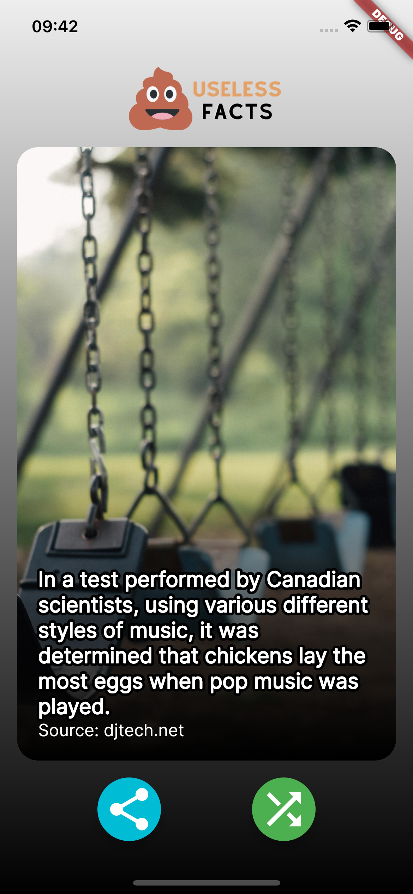

# Useless App
*Don't take life too serious*.

This project was presented through week six of Snow Academy (a Snow Man Labs initiative).

Its intent is very simple: the user presses the "random" button to get an useless, but true, fact. This whole process is possible thanks to the "Random Useless Facts" API (https://uselessfacts.jsph.pl/).

The app also shows a random image, which is not related at all to the fact. These images are provided by "https://picsum.photos/".

Finally, the user has an option to share the image. To make that possible, the "screenshot" flutter package (https://pub.dev/packages/screenshot) was used.

To run this project, besides cloning this repo, you must have Dart and Flutter installed on your PC, as well an IDE of your choice (e.g. Android Studio or VSCode).

Have fun!

